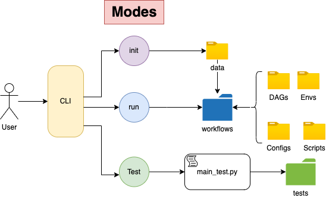

####################
 CytoSnake Tutorial
####################

*******
 About
*******

This tutorial assumes that you have follows the installation steps and
you are ready to start taking off with CytoSnake!

Cytosnake is a command line interface (CLI) tool that contains a
multiude of workflows for analyzing morhpological features obtained from
micrscropy images of cels.

**********
 Concepts
**********

Modes
=====

Modes provide options on how the user can change the functionality of
CytoSnake. For example, if you would like to initalize your files for a
specific workflow, you can simply type:

using the `init` mode

.. code::

   cytosnake init <DATAFILES> <METADATA> <DATATYPE>

-  `DATAFILE` will refer to the raw data that you are going to analyze,
-  `METADATA` refers to the associated metdata data directory that was
   generated along with the dataset
-  `DATATYPE` flag tells cytosnake weather these morphology feature
   datasets were obtained from CellProfiler or DeepProfiler

The init mode setups the provided input files into its appropriate file
structure that accommodates all the workflows available in Cat Snake

Currently, cytosnake supports three different types of modes, which are:

   #. inti: setups up input files for workflows
   #. run: execute a specific
   #. help: executes CytoSnake's CLI help documentation.

Configurations
==============

CytoSnake has configurational directory that allows users to change the
configurations for their specified workflows.

The configuration files are written in `.yaml` files, which contains all
the functions and its parameters used within the workflow. The
workflow's documentation provides information about the configuration
files involved within the workflow.

Users can easily find and change parameter values by accessing those
configurational files.

**********
 Usage
**********

To follow along