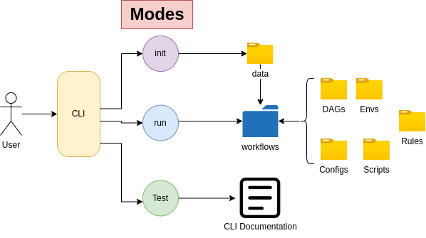

####################
 CytoSnake Tutorial
####################

*******
 About
*******

This tutorial assumes that you have follows the installation steps and
you are ready to start taking off with CytoSnake!

Cytosnake is a command line interface (CLI) tool that contains a
multitude of workflows for analyzing morphological features obtained
from microscopy images of cells.

**********
 Concepts
**********

Modes
=====

Modes provide options on how the user can change the functionality of
CytoSnake. For example, if you would like to initialize your files for a
specific workflow, you can simply type:

using the `init` mode

.. code::

   cytosnake init <DATAFILES> <METADATA> <DATATYPE>

-  `DATAFILE` will refer to the raw data that you are going to analyze,
-  `METADATA` refers to the associated metadata data directory that was
   generated along with the dataset
-  `DATATYPE` flag tells cytosnake weather these morphology feature
   datasets were obtained from CellProfiler or DeepProfiler

The init mode setups the provided input files into its appropriate file
structure that accommodates all the workflows available in CytoSnake

CytoSnake currently has three different types of modes, which are:

   #. **inti:** setups up input files for workflows
   #. **run:** execute a specific workflow
   #. **help:** executes CytoSnake's CLI help documentation.

Configurations
==============

CytoSnake has configurational directory that allows users to change the
configurations for their specified workflows.

The configuration files are written in `.yaml` files, which contains all
the functions and its parameters used within the workflow. The
workflow's documentation provides information about the configuration
files involved within the workflow.

**cp_process workflow docs**

.. _aggregate_docs: https://pycytominer.readthedocs.io/en/latest/pycytominer.html#module-pycytominer.aggregate

.. _annotate_docs: https://pycytominer.readthedocs.io/en/latest/pycytominer.html?highlight=annotate#pycytominer.annotate.annotate

.. _consensus_docs: https://pycytominer.readthedocs.io/en/latest/search.html?q=consensus&check_keywords=yes&area=default

.. _feature_select_docs: https://pycytominer.readthedocs.io/en/latest/pycytominer.html?highlight=feature%20select#pycytominer.feature_select.feature_select

.. _normalize_docs: https://pycytominer.readthedocs.io/en/latest/pycytominer.html?highlight=normalize#pycytominer.normalize.normalize

+-----------------+-------------------------------------------------------------------+-----------------------+
| Steps           | Path to config                                                    | Documentation         |
+=================+===================================================================+=======================+
| aggregate       | ./CytoSnake/configs/analysis_configs/aggregate_configs.yaml       | aggregate_docs_       |
+-----------------+-------------------------------------------------------------------+-----------------------+
| annotate        | ./CytoSnake/configs/analysis_configs/aggregate_configs.yaml       | annotate_docs_        |
+-----------------+-------------------------------------------------------------------+-----------------------+
| normalize       | ./CytoSnake/configs/analysis_configs/normalize_configs.yaml       | normalize_docs_       |
+-----------------+-------------------------------------------------------------------+-----------------------+
| feature_select  | ./CytoSnake/configs/analysis_configs/feature_select_configs.yaml  | feature_select_docs_  |
+-----------------+-------------------------------------------------------------------+-----------------------+
| consensus       | ./CytoSnake/configs/analysis_configs/consensus_configs.yaml       | consensus_docs_       |
+-----------------+-------------------------------------------------------------------+-----------------------+

**dp_process workflow** (Currently under development, may change in the
future)

.. _aggregatedeepprofiler_docs: https://github.com/cytomining/pycytominer/blob/289c4d322f08becec5e6a57104849f203540df41/pycytominer/cyto_utils/DeepProfiler_processing.py#L123-L156

.. _deepprofiler_data_docs: https://github.com/cytomining/pycytominer/blob/289c4d322f08becec5e6a57104849f203540df41/pycytominer/cyto_utils/DeepProfiler_processing.py#L19-L43

+----------------+--------------------------------------------------------------+------------------------------+
| Steps          | Path to config                                               | Documentation                |
+================+==============================================================+==============================+
| dp_data        | ./CytoSnake/configs/analysis_configs/dp_data_configs.yaml    | DeepProfiler_data_docs_      |
+----------------+--------------------------------------------------------------+------------------------------+
| dp_aggregator  | ./CytoSnake/configs/analysis_configs/dp_aggregator.yaml      | AggregateDeepProfiler_docs_  |
+----------------+--------------------------------------------------------------+------------------------------+
| normalize      | ./CytoSnake/configs/analysis_configs/normalize_configs.yaml  | normalize_docs_              |
+----------------+--------------------------------------------------------------+------------------------------+
| consensus      | /CytoSnake/configs/analysis_configs/consensus_configs.yaml   | consensus_docs_              |
+----------------+--------------------------------------------------------------+------------------------------+

Users can easily find and change parameter values by accessing those
configurational files.

-  `steps`: instructions that the workflows
-  `Path to config` Location of the configurational files
-  `Documentation` Relevant pycytominer documentation of

*******
 Usage
*******

Download data
=============

.. _barcode: https://minhaskamal.github.io/DownGit/#/home?url=https://github.com/broadinstitute/cell-health/blob/master/1.generate-profiles/data/metadata/barcode_platemap.csv

.. _metadata_folder: https://minhaskamal.github.io/DownGit/#/home?url=https://github.com/broadinstitute/cell-health/tree/master/1.generate-profiles/data/metadata

.. _plate_data_1: https://nih.figshare.com/ndownloader/files/18506036

.. _plate_data_2: https://nih.figshare.com/ndownloader/files/18031619

In this usage tutorial, we will be using data cell health datasets.

You can download these datasets (quite large files):

-  plate_data_1_: (10GB download)
-  plate_data_2_: (11GB download)
-  metadata_folder_: Contains all associated perturbations per well
-  barcode_: Maps plate id with plate names

You can also use your dataset but some of the tasks that are being done
here are specific to the files downloaded.

Setting up files
================

If you are using the downloaded dataset. unzip the zip files in the
directory where the CytoSnake source is.

.. code::

   unzip metadata.zip && unzip barcode_platemap.csv.zip

The first step it to prepare your files for analysis, this is simply
executed by typing:

.. code::

   cytosnake init -d SQ00014613.sqlite SQ00014613.sqlite -d metadata -b barcode_platemap.csv

In instances where you may have a lot of data, CytoSnake supports
wildcard variables.

.. code::

   cytosnake init -d *.sqlite -d metadata -b barcode_platemap.csv

If there is an instances were you are going to use morphological
datasets obtained from DeepProfiler, then you must explicitly state the
datatype flag when using `init`:

.. code::

   cytosnake init -d *.sqlite -d metadata -b barcode_platemap.csv --datatype deep_profiler

Once entering the command, your out put should look like this:

.. code::

   INFO: Formatting input files
   INFO: Formatting complete!

Running Workflow
================

In your current working directory, a new folder ./data should appear in
your current directory. Inside the directory, it should contain symbolic
links of your data files that you have provided in the init mode. This
directory serves as centralized location of data for the workflows to
have access too. Now that you have your data folder, you can simply
select which workflow to execute by using the run mode. Since the
cell-health dataset contains data extracted from CellProfiler, when we
will used the cp_process workflow.

.. code::

   cytosnake run cp_process

If your data contains features that were extracted by using
DeepProfiler, then the dp_process workflow must be executed

.. code::

   cytosnake run dp_process

These workflows contain their own environments, therefore there is not
need to download the dependencies that our workflows require. When the
the job is done, the last message you should see is:

.. code::

   [Mon Sep 19 14:29:07 2022]
   Finished job 0.
   2 of 2 steps (100%) done

This indicates that all tasks within the workflow is complete.

Accessing data
==============

In your directory, a `results` folder will be produced which contains
all the outputs generated from the workflow. To visualize those outputs,
simply type:

.. code::

   cd results/preprocessing/ && ls

This will take you to the directory where the generated outputs are and
lists all the files.

.. code::

   consensus.tsv.gz                  SQ00014614_aggregate.csv.gz
   SQ00014613_aggregate.csv.gz       SQ00014614_augmented.csv.gz
   SQ00014613_augmented.csv.gz       SQ00014614_cell_counts.tsv
   SQ00014613_cell_counts.tsv        SQ00014614_feature_select.csv.gz
   SQ00014613_feature_select.csv.gz  SQ00014614_normalized.csv.gz
   SQ00014613_normalized.csv.gz

These files contain different types of information that is denoted by
their suffix:

-  `_cell_counts.tsv`: Number of cells in the dataset

-  `_aggregate`: Refers to the aggregated dataset. Single cell dataset
   (your inputs) are aggregated into the “well” level.

-  `_augmented`: A datasets contains metadata information in a per well
   level. For example, types of metadata can be: well position,
   treatments, controls, etc

-  `_feature_select`: contains the selected morphological features that
   will be used to generate consensus profiles

-  `_consensus`: is the consensus profile contains unique morphological
   signatures associated with a specific external treatment (drug,
   perturbations, controls (pos/neg), etc)
