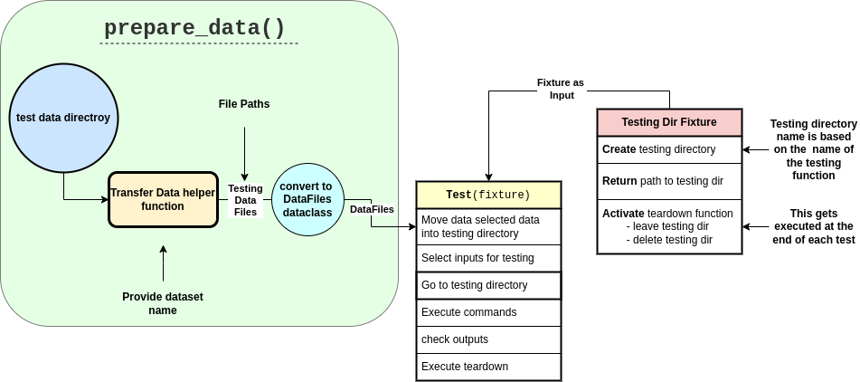

## CytoSnake Testing General Documentation

<!-- 

  

 -->

>This diagram illustrates the testing framework of `CytoSnake`, showcasing the main objectives of each core testing module.

Welcome to the testing documentation for `CytosSnake`, where you'll learn the essential principles of crafting effective and insightful tests.
Our tests are centered around ensuring that CytoSnake stands as a robust and dependable software tool, capable of generating reproducible workflows for single-cell morphology profiles.

In this documentation, you will gain insight into creating tests within CytoSnake, ensuring that every user who uses the `CytoSnake` can get a reliable experience.

Below are the written documentation for each testing suite:

- [Functional testing](../docs/func-tests.md)
- [Unit testing](../docs/unit-tests.md)
- [Workflow testing](../docs/workflow-tests.md)

## Rationale and Motivation

Below are the rationals and motivations behind generating tests for `CytoSnake`

### Performance

Remarkable technological advances have occurred within the field of high-throughput microscopy imaging, generating a surmount of image-based profiles, also known as morphology profiles.
With this increase in data, there is a high need for high-performing software tools that can not only scale with large volumes of single-cell morphology profiles but also create a tool that can orchestrate various analytical tools and make them reproducible.
Our tests in `CytoSnake` are designed to align with our goals of scale, performance, and orchestration. By rigorously evaluating core functionality, we ensure that users can quickly obtain reproducible conclusions from their data, enabling faster insights and analysis.

### Reproducibility

Reproducibility is an integral part of Cytosnake ensuring the reliable robust conclusions.
Our tests are designed to ensure reproducibility by monitoring `CytoSnake`'s functionality across different scenarios.
This means that CytoSnake will be subjected to various inputs and conditions to test actively identifying and capturing any inconsistencies with the generated outputs.
Our testing design aims to offer researchers in the community a sense of reliability, ensuring they can consistently achieve reproducible results that reinforce robust scientific conclusions.
Overall, `CytoSnake`'s tests are designed to not only reach robust conclusions but also accelerate progress in the field of Cell biology, enabling faster and more reliable advancements.

### User-friendliness and Portability

While prioritizing reproducibility is crucial, we also intend to make `CytoSnake` accessible to a broader audience, ensuring its user-friendliness and portability.
Our tests are deployed in GitHub Actions, allowing for multi-platform testing across different operating systems, ensuring `CytoSnake` is system agnostic.
In addition, we use the `Poetry` package to manage dependencies, assuring that the software can be easily installed.
We leverage the `conda` environment manager to encapsulate dependencies within `CytoSnake`'s modules allowing it to be portable and consistent across all systems.
Ultimately, our tests aim to provide users with an easy and enjoyable experience while using `CytoSnake`, by providing the convenience of being portable and requiring little effort to use it.

## Best Practices

We believe that implementing good testing practices can create software that's not only robust but also significantly more dependable.
This ensures a high level of reliability for users and developers to conduct their analysis with confidence in `CytoSnake`.

Outlined below are the best practices that we consider instrumental in helping us achieve our goals.

### Tech stack

Our testing suite uses [`pytest`](https://docs.pytest.org/en/7.4.x/) a very powerful, flexible and easy-to-use testing framework.
Its user-friendliness enables developers to write and execute tests easily, providing rapid development.
Additionally, Pytest's modular fixtures and extensive customization provide great opportunities with CytoSnake's development workflow, enhancing code quality and adaptability while maintaining a smooth and efficient testing process.

We also use `Code Coverage` as a metric for our tests to ensure high code quality and prevent code decay.
Through development, we use code coverage as a monitoring tool that ensures that `CytoSnake`'s codebase remains robust against decay, preventing any bugs that might arise over time.
This approach ensures that all functionalities of `CytoSnake` are thoroughly tested, making it a dependable software tool. Additionally, developers have the flexibility to create their own datasets, as long as they adhere to CytoSnake's established standards.

### Dataset

We use structured datasets that attempt to emulate different uses of CytoSnake. These datasets have different versions to cover various situations that might occur when users interact with CytoSnake.

### Clear and Descriptive test

In `CytoSnake`, well-structured testing documentation plays an important role.
It simplifies the software experience for both users and developers by providing a clear understanding of what is being tested within `CytoSnake`.
We believe that providing easy-to-follow documentation generated from users can serve as a valuable resource. Documentation not only helps in understanding the testing processes but also offers insights into the overall functionality of `CytoSnake`.
By capturing diverse scenarios and potential edge cases, this documentation becomes a reliable reference for users seeking to understand `CytoSnake`'s capabilities.
Overall, we want the community to refine and expand the testing suite iteratively, ensuring robustness and thoroughness in maintaining `Cytosnake`'s quality.
With this approach, we like a collaborative ecosystem where documentation and testing help each other, leading to a more stable, reliable, and user-friendly `CytoSnake` environment.
